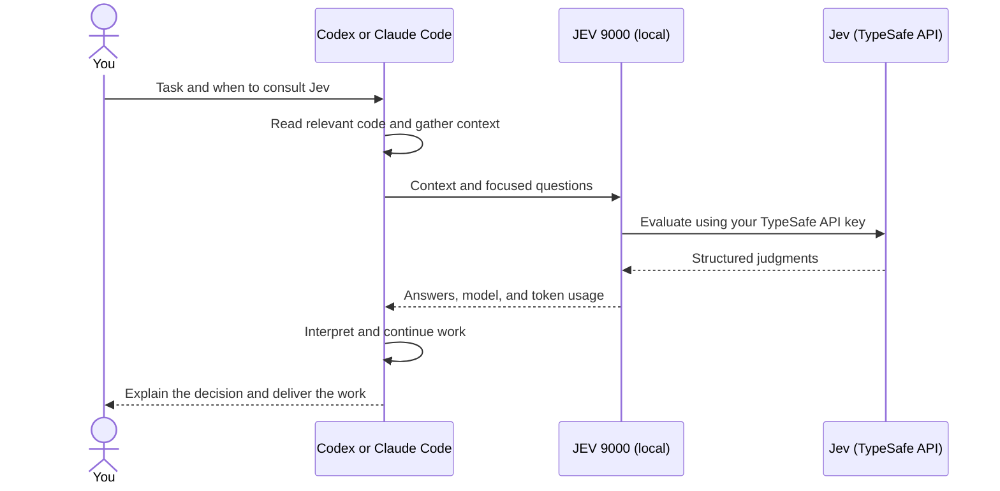

<p align="center">
  
</p>

<p align="center">
  <a href="#install"></a>
  <a href="#install"></a>
  <a href="#install"></a>
  <a href="#requirements"></a>
  <a href="https://docs.typesafe.ai/introduction"></a>
</p>

<p align="center">
  <a href="#install"><b>Install</b></a> ·
  <a href="#use-it">Use it</a> ·
  <a href="#how-it-works">How it works</a> ·
  <a href="#examples">Examples</a> ·
  <a href="#update">Update</a> ·
  <a href="#logging-and-settings">Settings</a> ·
  <a href="#development">Development</a>
</p>

---

**JEV 9000** is a plugin for **Codex** and **Claude Code** that gives your coding
agent a second opinion while it works. The agent consults
[Jev](https://docs.typesafe.ai/introduction), TypeSafe's model for structured
judgments, to check an assumption, compare approaches, or assess a trade-off,
then interprets the result and carries on with your task. You stay in the same
conversation throughout.

> Ask Jev whether this design meets the requirement before implementing it.

## Install

### Requirements

- **Node.js 22.18+** and Git
- A current **Codex CLI** or **Claude Code** installation
- Your own **TypeSafe API key** (see below). Consultations make API calls using
  your TypeSafe account.

### Get a TypeSafe API key

1. Sign in or create an account at the [TypeSafe console](https://console.typesafe.ai).
2. Open [API keys](https://console.typesafe.ai/keys) and create a key.
3. Keep it handy for [step 2](#2-add-your-typesafe-key) below.

> [!TIP]
> New TypeSafe users get **$5 of free credit**, with no credit card needed.
> See the [TypeSafe quick start](https://docs.typesafe.ai/introduction/quickstart)
> for more.

### 1. Add the plugin

**Claude Code**

```sh
claude plugin marketplace add ossianravn/jev-9000
claude plugin install jev-9000@jev-9000
```

Inside an interactive Claude session, use `/plugin` instead of `claude plugin`.
Choose user scope to use JEV across your projects.

**Codex CLI**

```sh
codex plugin marketplace add ossianravn/jev-9000
codex plugin add jev-9000@jev-9000
```

Run these in the environment where you use Codex. For WSL, that means your WSL
terminal with Linux Node.js, Git, and Codex installed.

> [!NOTE]
> The repository is a *marketplace*: a catalogue pointing to the ready-to-run
> plugin. Your host downloads and installs its own copy. There is nothing to
> clone or build.

### 2. Add your TypeSafe key

Create `~/.jev-9000/config.env` in your home directory, replacing the
placeholder with your own key:

```dotenv
TYPESAFE_API_KEY=your-key-here
TYPESAFE_MODEL=jev-latest
```

Then tell the plugin where to find it, and start `codex` or `claude` from that
same terminal.

**macOS / Linux / WSL**

```sh
export JEV_9000_ENV_FILE="$HOME/.jev-9000/config.env"
```

Add the line to your shell startup file, such as `~/.bashrc`, to keep it in
future terminals.

**Windows PowerShell**

```powershell
$env:JEV_9000_ENV_FILE = "$HOME/.jev-9000/config.env"
```

This applies to the current terminal and the host it starts. It does not update
an already-running desktop app.

> [!IMPORTANT]
> Keep `config.env` private. It lives outside the plugin cache, so plugin
> updates never replace your settings.

### 3. Test the connection

In a new session, ask:

> Use JEV 9000 to evaluate whether a browser-only import can reliably continue
> after the browser closes. Make a real Jev call and show me its judgment and
> model name. Do not modify any files.

You should see a `jev_evaluate` tool call followed by Jev's judgment and the
agent's explanation. Claude may ask you to allow the tool through its normal
permissions.

| Host | Find the plugin | Invoke the skill directly |
| --- | --- | --- |
| Claude Code | `/plugin` | `/jev-9000:jev-9000 <question>` |
| Codex | `/plugins` | `$jev-9000` |

<details>
<summary><b>Troubleshooting</b></summary>

- Check `node --version`, the environment-file path, and your TypeSafe key, then
  start a fresh session from the configured terminal.
- If Claude reports an expired OAuth session, run `claude auth login` and retry.
  That login belongs to Claude; your TypeSafe key configures Jev separately.

</details>

## Use it

Ask in ordinary language, either for a single decision:

> Ask Jev whether this design meets the requirement before implementing it.

or as a standing instruction in your chat or project instructions:

> Use Jev for database and API design decisions in this project.

> Use Jev when a second opinion would help.

The agent follows that scope, including later changes to it.

Jev answers three kinds of question:

| Your question | Jev question type | What the agent receives |
| --- | --- | --- |
| Does this retry strategy risk duplicate payments? | 🟢 **Noul**: a yes/no check | Probability of yes, such as `noul: 0.8` |
| Which approach best fits our constraints? | 🔵 **Choice**: compare alternatives | The selected option, probabilities for each option, and confidence |
| How much operating work would this new service add? | 🟠 **Score**: assess a defined scale | A score, the scale's labels, probabilities, and confidence |

For example, the agent might define operating work as **0: no new responsibilities,
1: configure an existing service, 2: operate a new service**. An illustrative
`score: 1.6` is a probability-weighted position on that scale. Choice and Score
confidence describe how concentrated their answer distributions are.

The agent can batch independent questions over the same context. When a follow-up
depends on an earlier answer, it makes a new call including that answer or the
changed facts. A failed consultation is reported as a failure, with an actionable
error, so the agent can correct it or continue according to your instructions.

## How it works



The plugin contains a **skill** that teaches the agent how to consult Jev and a
local **MCP tool** (`jev_evaluate`) that connects it to TypeSafe. MCP is the
protocol the coding agent uses to call tools. The host starts the local process
for you; you do not need to deploy a server.

Jev receives the context and questions the agent sends. It cannot open repository
paths or URLs itself, so the agent must include the relevant content. Jev returns
numbers and choices; your coding agent supplies the explanation and next action.

## Examples

### A consultation, from prompt to next action

Suppose imports must continue after a user closes the browser. Your project
already has a persistent job runner, and you want to reuse existing infrastructure.

**You ask:**

> Ask Jev whether we should run imports in the browser, use our existing job
> runner, or introduce a new queue service. Then implement the chosen approach.

**The agent inspects the project and asks a Choice question.** You do not need
to write this JSON yourself; it shows what crosses the tool boundary.

> [!NOTE]
> The request, response, and agent reply below are **illustrative**, with
> made-up response values. They are not a live result or a performance claim.

```json
{
  "state": {
    "goal": "Imports continue after the browser closes.",
    "existing": "A persistent server-side job runner is already deployed.",
    "priority": "Reuse infrastructure that meets the goal."
  },
  "questions": {
    "approach": {
      "type": "choice",
      "instructions": "Which approach best satisfies the goal and priority?",
      "criteria": {
        "browser": "Run in the browser until the tab closes.",
        "existing": "Use the existing persistent job runner.",
        "new": "Deploy a second persistent job service."
      }
    }
  }
}
```

**The tool returns this structured result to the agent:**

```json
{
  "model": "jev-1.13.0",
  "answers": {
    "approach": {
      "type": "choice",
      "choice": "existing",
      "probabilities": { "browser": 0, "existing": 1, "new": 0 },
      "confidence": 1
    }
  },
  "usage": { "input_tokens": 300, "output_tokens": 25 }
}
```

**The agent explains and continues:**

> Jev selected the existing runner. Given your requirement and the infrastructure
> already in place, I'll move the import into a server-side job and verify that
> closing the tab leaves it running.

That explanation comes from the coding agent. Jev's Choice probabilities compare
the supplied options; even a value of `1` is not a guarantee the implementation
will succeed. The agent still owns implementation and verification.

### Let Jev help choose skills

If your agent has several skills available, Jev can help it decide which ones
fit the task:

> Ask Jev which of my available skills would help diagnose these checkout
> failures. Then use the relevant skills to investigate.

The agent sends the task, constraints, and candidate skill names and descriptions.
It asks a separate yes/no relevance question for each candidate in one call,
so several skills can fit, or none. Illustrative judgments might be:

| Candidate skill | Probability that using it would help |
| --- | ---: |
| Diagnosing bugs | 0.96 |
| Backend development | 0.82 |
| Frontend design | 0.09 |

The agent interprets those judgments, reads the selected skill instructions,
and gets on with the investigation. Jev sees the descriptions supplied to it;
the agent owns discovery and loading. Skills you explicitly request, or that
project instructions require, still apply regardless of Jev's judgment.

> [!TIP]
> For ongoing use, add a standing instruction: *Use Jev to help select relevant
> skills for my tasks.*

### Plan or build a UI with Jev

Use Jev to help your agent decide which components belong on a screen and which
arrangement supports the people using it. You can ask for a plan first:

> Plan an invoice screen for a freelancer who needs to find overdue invoices
> and follow up with customers. Ask Jev to help choose components from our
> project and compare useful layout alternatives. Show me the plan before coding.

Or ask the agent to carry the work through:

> Build that invoice screen. Use Jev for component and layout decisions where
> useful, then implement and verify the interactions.

The agent inspects your project and supplies Jev with the audience's goal,
requirements, available data and actions, and concrete component candidates.
For example, it describes an overdue filter's behavior rather than sending
only the name `Select`.

| Decision | What Jev receives | What comes back |
| --- | --- | --- |
| Include an overdue filter? | Its behavior and the invoice follow-up task | A Noul: probability that including it helps |
| Include a revenue chart? | What the chart shows and the screen's purpose | A separate Noul; multiple components can fit |
| Use summary cards or a compact row? | Both arrangements, showing the same summary information | A Choice, option probabilities, and confidence |

As an **illustrative, made-up result**, Jev might return `overdue_filter: 0.94`,
`revenue_chart: 0.12`, and choose `compact_row`. The agent could then propose a
compact summary above the invoice table, an overdue filter, and a reminder
action for each eligible invoice, explaining how that serves the task.

The agent keeps required content, resolves dependencies and duplicated information,
and accounts for empty screens, errors, and action feedback where relevant. It
owns the explanation, implementation, and verification. Jev judges the options
supplied; it does not generate the UI code, missing content, or action handlers.

The same workflow can assess improvements to an existing screen. Planning stops
at the requested plan; building continues into the project's normal UI stack.
No additional rendering library or runtime Jev integration is required.

## Update

Exit the active session first. Your external configuration file stays in place,
and this plugin does not configure automatic updates.

**Claude Code**

```sh
claude plugin marketplace update jev-9000
claude plugin update jev-9000@jev-9000
claude plugin list
```

The first command refreshes the catalogue; the second updates the installed
plugin. You can also enable marketplace auto-updates through Claude's `/plugin`
panel. See [Claude's installation and update guide](https://code.claude.com/docs/en/discover-plugins).

**Codex CLI**

```sh
codex plugin marketplace upgrade jev-9000
codex plugin add jev-9000@jev-9000
codex plugin list --marketplace jev-9000 --json
```

The listing shows the installed version and enabled state. See
[Codex's marketplace commands](https://learn.chatgpt.com/docs/developer-commands).

Start a new session from your configured terminal to load the update.

## Logging and settings

Consultation logs are **on by default**, saved locally under `~/.jev-9000/logs`.
They include the context sent to Jev, answers or errors, timing, model, and
token usage. Known credentials are scrubbed, but logs can still contain project
content. A logging failure leaves the consultation usable and reports a diagnostic.

Settings go in your environment file. Restart the host after changing them.

| Setting | Default | Purpose |
| --- | --- | --- |
| `TYPESAFE_API_KEY` | none (required) | Your TypeSafe API key |
| `TYPESAFE_MODEL` | `jev-latest` | Model to use; `TYPESAFE_DEFAULT_MODEL` takes precedence |
| `JEV_9000_LOGGING` | `true` | Set `false` to stop new consultation logs; existing logs remain |
| `JEV_9000_LOG_DIR` | `~/.jev-9000/logs` | Where new logs are stored |
| `JEV_9000_ENV_FILE` | plugin's own `.env` | Path to the environment file (set in your shell) |

Existing process environment variables take precedence over the environment file.
Model selection uses a per-call `model` first, then `TYPESAFE_DEFAULT_MODEL`,
`TYPESAFE_MODEL`, and finally `jev-latest`. Each response names the resolved model.
Disabling local logging does not change the context sent to TypeSafe.

## Evaluations

Does it help on your tasks? The repository includes a manual runner that
compares tasks completed with and without the plugin, grades the final
artifacts, and captures how the agent used Jev. Evaluations run only when you
invoke them. After cloning, run `npm ci` and `npm run build`, then:

```sh
npm run eval:run -- --case cache-recovery --env ../jev-9000.env --out ../jev-eval-example
npm run eval:report -- --root ../jev-eval-example
```

Use a new `--out` directory for each experiment; omitting it saves evidence under
`~/.jev-9000/evals`. Trials use the host CLI and can make model/API calls. Reports
use saved evidence without new model calls. Manual trials still save host traces
and artifacts when consultation logging is off; leave logging enabled to include
consultation records. See the [evaluation guide](evals/README.md) for cases,
settings, and interpreting reports.

<details>
<summary><b>Current evidence</b></summary>

Codex consultations have been exercised in actual host tasks. Three paired
coding trials passed with and without Jev; they do not yet demonstrate better
outcomes.

On September 29, 2026, Claude Code 2.1.283 passed a fresh GitHub install,
marketplace refresh, and current-version update check on Windows. Claude
discovered the installed skill and connected its MCP server. After loading the
skill, Claude made a real Jev call with Noul, Choice, and Score questions and
continued with a recommendation and plan. This ran outside the developer
checkout using the installed cache and an external settings file.

This verifies the consultation workflow, not improved outcomes or every agent
use case. WSL execution remains unverified.

</details>

## Development

Clone the repository and run `npm ci`. Editable source, skills, and manifests
live at the repository root. `plugins/jev-9000/` is the generated distribution
that GitHub installations consume; regenerate it rather than editing it directly.

```sh
npm run check
npm test
npm run build
npm run smoke -- --mode mixed --env ../jev-9000.env
```

Tests use simulated API responses and local files. The smoke command makes a
real TypeSafe call through the plugin's MCP tool. Add `--root /installed/plugin`
to check an installed copy, or `--host claude` to use Claude's MCP configuration.

Claude's manifests are `.claude-plugin/marketplace.json` for the catalogue and
`.claude-plugin/plugin.json` inside the plugin. Its `.mcp.json` starts the bundled
runtime from Claude's installed cache, following
[Claude's plugin format](https://code.claude.com/docs/en/plugins-reference).

### Publishing an update

1. Update the version in `package.json`, the lockfile's root package, and all
   three plugin manifests at the repository root, plus the plugin entry in
   `.claude-plugin/marketplace.json`.
2. Run `npm run package` to rebuild the runtime and refresh the entire generated
   plugin, including skills and this README. The command checks manifest versions.
3. Validate the affected behavior and review the generated diff. Commit and push
   both the source changes and `plugins/jev-9000/` to `main`.

The marketplace points at that committed directory, so a source-only commit
does not publish updated plugin behavior. Each release needs a new plugin version.

---

<p align="center"><sub>JEV 9000 is named after HAL 9000, though Jev is far more cooperative.</sub></p>
