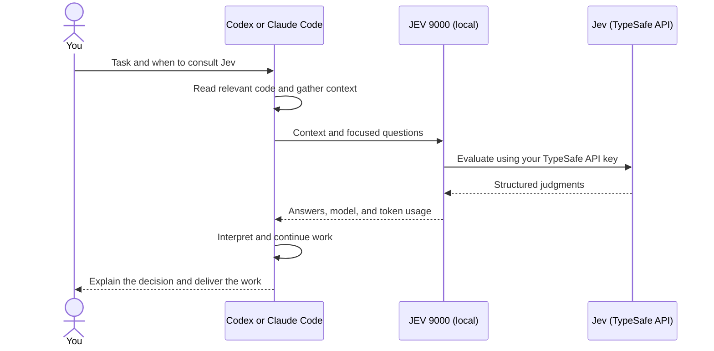

# JEV 9000

Give your coding agent a second opinion while it works.

JEV 9000 is a plugin for **Codex and Claude Code**. It lets your agent consult
[Jev](https://docs.typesafe.ai/introduction), TypeSafe's model for structured
judgments, to check an assumption, compare approaches, or assess a trade-off.
Your agent gathers the context, interprets the result, and continues your task.

You use ordinary prompts:

> Ask Jev whether this design meets the requirement before implementing it.

You can also give a standing instruction in your chat or project instructions:

> Use Jev for database and API design decisions in this project.

> Use Jev when a second opinion would help.

The agent follows that scope, including later changes to it. You stay in the
same conversation throughout.

## How it works



The plugin contains a **skill** that teaches the agent how to consult Jev and a
local **MCP tool** (`jev_evaluate`) that connects it to TypeSafe. MCP is the
protocol the coding agent uses to call tools. The host starts the local process
for you; you do not need to deploy a server.

Jev receives the context and questions the agent sends. It cannot open repository
paths or URLs itself, so the agent must include the relevant content. Jev returns
numbers and choices; your coding agent supplies the explanation and next action.

## A consultation, from prompt to next action

Suppose imports must continue after a user closes the browser. Your project
already has a persistent job runner, and you want to reuse existing infrastructure.

**You ask:**

> Ask Jev whether we should run imports in the browser, use our existing job
> runner, or introduce a new queue service. Then implement the chosen approach.

**The agent inspects the project and asks a Choice question.** You do not need
to write this JSON yourself; it shows what crosses the tool boundary.

The request, response, and agent reply below are **illustrative**, with made-up
response values. They are not a live result or a performance claim.

```json
{
  "state": {
    "goal": "Imports continue after the browser closes.",
    "existing": "A persistent server-side job runner is already deployed.",
    "priority": "Reuse infrastructure that meets the goal."
  },
  "questions": {
    "approach": {
      "type": "choice",
      "instructions": "Which approach best satisfies the goal and priority?",
      "criteria": {
        "browser": "Run in the browser until the tab closes.",
        "existing": "Use the existing persistent job runner.",
        "new": "Deploy a second persistent job service."
      }
    }
  }
}
```

**The tool returns this structured result to the agent:**

```json
{
  "model": "jev-1.13.0",
  "answers": {
    "approach": {
      "type": "choice",
      "choice": "existing",
      "probabilities": { "browser": 0, "existing": 1, "new": 0 },
      "confidence": 1
    }
  },
  "usage": { "input_tokens": 300, "output_tokens": 25 }
}
```

**The agent explains and continues:**

> Jev selected the existing runner. Given your requirement and the infrastructure
> already in place, I'll move the import into a server-side job and verify that
> closing the tab leaves it running.

That explanation comes from the coding agent. Jev's Choice probabilities compare
the supplied options; even a value of `1` is not a guarantee the implementation
will succeed. The agent still owns implementation and verification.

## Other questions the agent can ask

| Your question | Jev question type | What the agent receives |
| --- | --- | --- |
| Does this retry strategy risk duplicate payments? | **Noul** — a yes/no check | Probability of yes, such as `noul: 0.8`. |
| Which approach best fits our constraints? | **Choice** — compare alternatives | The selected option, probabilities for each option, and confidence. |
| How much operating work would this new service add? | **Score** — assess a defined scale | A score, the scale's labels, probabilities, and confidence. |

For example, the agent might define operating work as **0: no new responsibilities,
1: configure an existing service, 2: operate a new service**. An illustrative
`score: 1.6` is a probability-weighted position on that scale. Choice and Score
confidence describe how concentrated their answer distributions are.

The agent can batch independent questions over the same context. When a follow-up
depends on an earlier answer, it makes a new call including that answer or the
changed facts. A failed consultation is reported as a failure, with an actionable
error, so the agent can correct it or continue according to your instructions.

### Let Jev help choose skills

If your agent has several skills available, Jev can help it decide which ones
fit the task. For example:

> Ask Jev which of my available skills would help diagnose these checkout
> failures. Then use the relevant skills to investigate.

The agent sends the task, constraints, and candidate skill names and descriptions.
It asks a separate yes/no relevance question for each candidate in one call,
so several skills can fit, or none. With a catalogue containing these skills,
illustrative judgments might be:

| Candidate skill | Probability that using it would help |
| --- | ---: |
| Diagnosing bugs | 0.96 |
| Backend development | 0.82 |
| Frontend design | 0.09 |

The agent interprets those judgments, reads the selected skill instructions,
and gets on with the investigation. Jev sees the descriptions supplied to it;
the agent owns discovery and loading. Skills you explicitly request, or that
project instructions require, still apply regardless of Jev's judgment.

For ongoing use, add this standing instruction to your chat or project:

> Use Jev to help select relevant skills for my tasks.

## Get started

You need **Node.js 22.18+**, npm, Git, a working Codex or Claude Code installation,
and a **TypeSafe API key**. Get the key from the
[TypeSafe dashboard](https://console.typesafe.ai), as described in its
[quick start](https://docs.typesafe.ai/introduction/quickstart).
Consultations make API calls using your TypeSafe account.

### 1. Download and build

Run these commands in a terminal. The outer `jev-local` folder will hold your
local installation and, for Codex, its plugin catalogue.

```sh
mkdir jev-local
cd jev-local
git clone https://github.com/ossianravn/jev-9000.git
cd jev-9000
npm ci
npm run build
```

### 2. Configure your key

Create `../jev-9000.env` in the parent `jev-local` folder, **outside the cloned
plugin folder**, containing:

```dotenv
TYPESAFE_API_KEY=your-key-here
TYPESAFE_MODEL=jev-latest
```

In the clone, open `mcp.json` for Codex or `.mcp.json` for Claude Code. Add an
`env` field inside `mcpServers` → `jev-9000`, alongside `command` and `args`,
with this object as its value:

```json
{
  "JEV_9000_ENV_FILE": "/absolute/path/to/jev-local/jev-9000.env"
}
```

Replace the path with your actual absolute path. On Windows, forward slashes work,
for example `C:/tools/jev-local/jev-9000.env`. Configure both files if you use both
hosts. This lets installed copies find your settings while the key stays outside
the plugin package. Keep the environment file private and out of version control.

### 3. Load the plugin in your agent

**Codex**

Codex installs local plugins through a *marketplace*: a JSON catalogue pointing
to plugin folders. In `jev-local`, create `.agents/plugins/marketplace.json`
(including its parent folders) with this content:

```json
{
  "name": "jev-local",
  "interface": { "displayName": "JEV 9000 Local" },
  "plugins": [
    {
      "name": "jev-9000",
      "source": { "source": "local", "path": "./jev-9000" },
      "policy": { "installation": "AVAILABLE", "authentication": "ON_INSTALL" },
      "category": "Productivity"
    }
  ]
}
```

From the cloned `jev-local/jev-9000` folder, run:

```sh
codex plugin marketplace add ..
codex plugin add jev-9000@jev-local
```

Start a new Codex chat. Invoke `$jev-9000` and ask your question, or select
JEV 9000 from the skills/plugins picker. See
[Codex's local plugin guide](https://developers.openai.com/plugins/build/plugins#install-a-local-plugin-manually)
for other marketplace layouts.

**Claude Code**

Start a session with the built plugin folder:

```sh
claude --plugin-dir /absolute/path/to/jev-local/jev-9000
```

Invoke `/jev-9000:jev-9000` and ask your question. This
[session-local loading method](https://code.claude.com/docs/en/plugins/create#develop-without-a-marketplace)
loads the plugin for that session; use the flag each time you start one.

**Try it:** “Ask Jev whether a browser-only import can keep running after the tab
closes.” The agent should call Jev, explain its judgment, and respond to the task.
If setup fails, check the environment-file path, key, and build output, then
restart the host/plugin process. Setting variables in another terminal does not
update an already-running desktop app.

## Logging and settings

Consultation logs are **on by default**, saved locally under `~/.jev-9000/logs`
(`~` means your home directory). They include the context sent to Jev, answers or
errors, timing, model, and token usage. Known credentials are scrubbed, but logs
can still contain project content. A logging failure leaves the consultation
usable and reports a diagnostic.

To stop new consultation logs, add this to your environment file and restart
the host/plugin process:

```dotenv
JEV_9000_LOGGING=false
```

Set `true` or remove the setting to re-enable logging. Existing logs remain.
`JEV_9000_LOG_DIR` changes where new logs are stored. Disabling local logging
does not change the context sent to TypeSafe for a consultation.

Existing process environment variables take precedence over the environment file.
If `JEV_9000_ENV_FILE` is unset, the plugin looks for `.env` in its own root.
Model selection uses a per-call `model` first, then `TYPESAFE_DEFAULT_MODEL`,
`TYPESAFE_MODEL`, and finally `jev-latest`. Each response names the resolved model.

## Evaluations: does it help on your tasks?

The repository includes a manual runner that compares tasks completed with and
without the plugin, grades the final artifacts, and captures how the agent used
Jev. Evaluations run only when you invoke them. From the cloned folder:

```sh
npm run eval:run -- --case cache-recovery --env ../jev-9000.env --out ../jev-eval-example
npm run eval:report -- --root ../jev-eval-example
```

Use a new `--out` directory for each experiment; omitting it saves evidence under
`~/.jev-9000/evals`. Trials use the host CLI and can make model/API calls. Reports
use saved evidence without new model calls. Manual trials still save host traces
and artifacts when consultation logging is off.
Leave logging enabled to include consultation records. See the
[evaluation guide](evals/README.md) for cases, settings, and interpreting reports.

**Current evidence:** Codex consultations have been exercised in actual host
tasks. Three paired coding trials passed with and without Jev; they do not yet
demonstrate better outcomes. Claude's MCP connection has been checked, but a full
agent trial remains unverified because the test login expired. Details are in the
[implementation and verification record](.dev-docs/IMPLEMENTATION.md).

## Development

```sh
npm run check
npm test
npm run build
npm run smoke -- --mode mixed --env ../jev-9000.env
```

Tests use simulated API responses and local files. The smoke command makes a
real TypeSafe call through the plugin's MCP tool. Add `--root /installed/plugin`
to check an installed copy, or `--host claude` to use Claude's MCP configuration.

JEV 9000 is named after HAL 9000.
